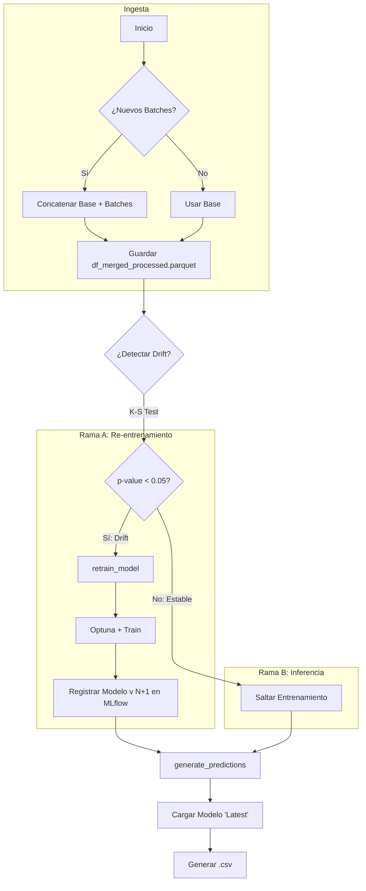
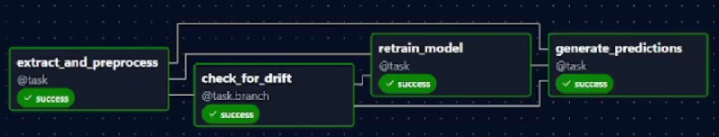
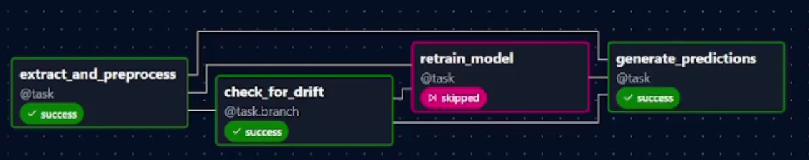

# Pipeline de Producción SodAI Drinks

Este documento describe el pipeline de MLOps desarrollado para el proyecto SodAI Drinks. Este sistema orquesta el ciclo de vida completo del modelo de predicción de compras, implementando una arquitectura condicional que detecta cambios en los datos (*Data Drift*) para decidir automáticamente si es necesario re-entrenar el modelo.

## [0. Video de la ejecución del DAG](https://www.youtube.com/watch?v=rdVcdinOhw8)

## 1. Descripción del DAG: `sodai_production_pipeline`

El pipeline utiliza una arquitectura de **Grafo Dirigido con Ramificaciones (Branching DAG)**.

### Tareas del Pipeline

1.  **`extract_and_preprocess`**
    * **Funcionalidad (Ingesta Incremental):** Carga los datos base (Entrega 1) y busca automáticamente nuevos archivos en `data/batches/`. Concatena todos los datos disponibles, limpia y procesa el conjunto completo.
    * **Gestión de Memoria:** Guarda el resultado en `data/processed/df_merged_processed.parquet` y pasa solo la ruta del archivo (patrón *pass-by-file*).
    * **Referencia:** Si es la primera ejecución, genera automáticamente un archivo `df_merged_reference.parquet` para futuras comparaciones de drift.

2.  **`check_for_drift` (Branching)**
    * **Funcionalidad:** Compara estadísticamente los datos recién procesados contra los datos de referencia.
    * **Lógica (Script `validation_drift.py`):** Ejecuta el test de **Kolmogorov-Smirnov (K-S)** en las variables numéricas clave.
    * **Decisión:**
        * **Si hay Drift (p-value < 0.05):** Desvía el flujo hacia la tarea `retrain_model`.
        * **Si NO hay Drift:** Desvía el flujo directamente a `generate_predictions`, saltando el costoso re-entrenamiento.

3.  **`retrain_model` (Condicional)**
    * **Estado:** Se ejecuta *solo* si se detecta drift (o en el arranque inicial).
    * **Lógica:** Carga los datos, genera features, libera memoria y ejecuta **Optuna** para optimizar hiperparámetros. Entrena un nuevo modelo LightGBM y lo registra en **MLflow** como una nueva versión.
    * **Interpretabilidad:** Genera y registra un gráfico **SHAP Summary Plot** como artefacto en MLflow para explicar el nuevo modelo.

4.  **`generate_predictions`**
    * **Estado:** Se ejecuta siempre (`trigger_rule=none_failed`), ya sea con un modelo recién entrenado o con el modelo vigente existente.
    * **Lógica:** Carga la versión `latest` del modelo desde el registro de MLflow. Genera predicciones para la "próxima semana" (t+2).
    * **Salida:** Guarda las predicciones en formato **.csv** (`latest_predictions.csv`).

---

## 2. Diagrama de Flujo del Pipeline

El siguiente diagrama ilustra la lógica condicional y el flujo de datos.

---

## 3. Representación Visual 

A continuación, se muestra el DAG en la interfaz de Airflow tanto para la Rama A como la Rama B respectivamente:

---

## 4. Instrucciones de Operación
 Para simular la llegada de un nuevo batch semanal (ej. semana 1 de Julio):

1. Coloque el archivo batch_t1.parquet en la carpeta data/batches/.

2. Dispare el DAG manualmente en Airflow.

3. El sistema detectará el archivo, lo integrará y evaluará si el modelo actual sigue siendo válido.

Si el sistema se reinicia completamente (base de datos de MLflow vacía):

1. Es necesario forzar una primera ejecución de entrenamiento para crear la "Versión 1" del modelo.

2. El pipeline está configurado para manejar esto, pero si falla la primera predicción por "Modelo no encontrado", se puede modificar temporalmente check_for_drift para retornar True una sola vez.

### Resultados
* Métricas y Modelos: Disponibles en MLflow (http://localhost:5000).

* Predicciones: Archivo generado en predictions/latest_predictions.csv.

## Requisitos Técnicos
El pipeline se ejecuta en un entorno local WSL2 (Ubuntu) para garantizar compatibilidad con las librerías de Airflow.

* Python: 3.11

* Orquestador: Apache Airflow (Standalone mode, sin ejemplos).

* Tracking: MLflow (Backend SQLite).

* Modelo: LightGBM + Scikit-Learn.

* Drift Detection: Scipy (Kolmogorov-Smirnov).
